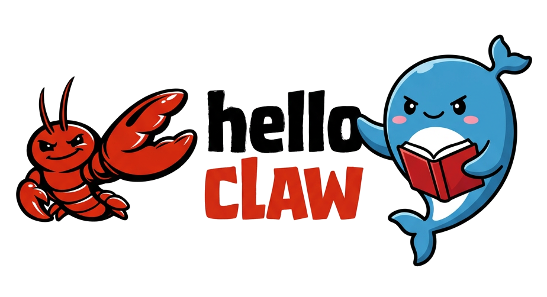
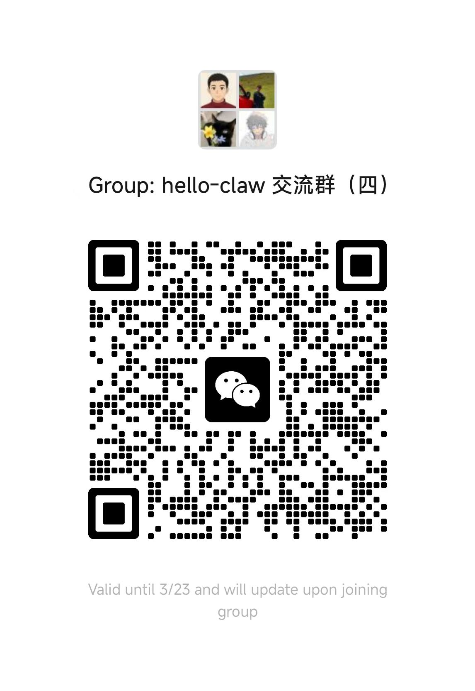

<div align="center">



<p align="center"><em>一个不起眼的仓库里，龙虾诞生了。<br>选一只，送它上学堂；或动手写一只不被定义的龙虾。<br>它的梦想，从第一天起就很大。</em></p>

# 🦞 Hello Claw

<p align="center"><strong>领养你的 AI 龙虾助理 · 上龙虾大学学 Skills · 从零构建属于你的智能助理</strong></p>

<p align="center">
  📌 <a href="https://tasarinan.github.io/">在线阅读</a> | 💬 <a href="#交流群">加入交流群</a>
</p>

<p align="center">
    <a href="https://github.com/datawhalechina/hello-claw/stargazers" target="_blank">
        </a>
    <a href="https://github.com/datawhalechina/hello-claw/network/members" target="_blank">
        </a>
    <a href="LICENSE" target="_blank">
        </a>
</p>

<p align="center">
  <a href="README.md"></a>
  <a href="README_EN.md"></a>
</p>

</div>

> [!WARNING]
> 🧪 Beta公测版本：教程主体已完成，正在优化细节，欢迎提 Issue 反馈问题或建议。

---

## 📚 内容总览

本仓库提供 **五大学习模块**，覆盖从入门到精通的完整路径：

| 模块 | 说明 | 适合人群 |
|------|------|----------|
| 🦞 [领养龙虾](#-领养龙虾使用篇) | OpenClaw 安装与使用（11章+7附录） | 零基础用户、效率达人 |
| 🎓 [龙虾大学](#-龙虾大学场景实战) | Skills 选修与场景实战 | 想快速落地的用户 |
| 🛠️ [构建龙虾](#️-构建龙虾开发篇) | 源码拆解与定制开发（15章） | 开发者、技术爱好者 |
| 💻 [Claude Code 教程](#-claude-code-教程) | Anthropic 官方编程工具完整指南（11章） | 程序员、AI 开发者 |
| 📘 [OpenClaw 指南](#-openclaw-指南) | 第三方深度教程（12章） | 进阶用户 |

---

## 🦞 领养龙虾（使用篇）

> **11 章 + 7 附录** | 安装 → 核心配置 → 扩展运维 → 安全与客户端

<details>
<summary><b>🔵 安装（第 1-3 章）</b></summary>

| 章节 | 内容 | 状态 |
|------|------|------|
| 第 1 章 AutoClaw 一键安装 | 下载桌面客户端，5 分钟零门槛体验 | ✅ |
| 第 2 章 OpenClaw 手动安装 | 终端介绍、Node.js、npm install、onboard | ✅ |
| 第 3 章 初始配置向导 | CLI 向导、macOS 引导、Custom Provider | ✅ |

</details>

<details>
<summary><b>🟢 核心配置（第 4-6 章）</b></summary>

| 章节 | 内容 | 状态 |
|------|------|------|
| 第 4 章 聊天平台接入 | 飞书/QQ/Telegram 接入、配对与群聊 | ✅ |
| 第 5 章 模型管理 | 多提供商配置、API Key 轮换、故障转移 | ✅ |
| 第 6 章 智能体管理 | 多 Agent 管理、工作区、心跳、绑定规则 | ✅ |

</details>

<details>
<summary><b>🟡 扩展运维（第 7-9 章）</b></summary>

| 章节 | 内容 | 状态 |
|------|------|------|
| 第 7 章 工具与定时任务 | cron/at/every 调度、Web 搜索 | ✅ |
| 第 8 章 网关运维 | 热更新、认证安全、沙箱策略、日志监控 | ✅ |
| 第 9 章 远程访问与网络 | SSH 隧道、Tailscale 组网、部署架构 | ✅ |

</details>

<details>
<summary><b>🔴 安全与客户端（第 10-11 章）</b></summary>

| 章节 | 内容 | 状态 |
|------|------|------|
| 第 10 章 安全防护与威胁模型 | VM 隔离、信任边界、MITRE ATLAS | ✅ |
| 第 11 章 Web 界面与客户端 | Dashboard、WebChat、TUI、第三方客户端 | ✅ |

</details>

<details>
<summary><b>📎 附录 A-G</b></summary>

| 附录 | 内容 |
|------|------|
| 附录 A | 学习资源汇总（80+ 链接） |
| 附录 B | 社区之声与生态展望 |
| 附录 C | 类 Claw 方案对比与选型 |
| 附录 D | 技能开发与发布指南 |
| 附录 E | 模型提供商选型指南 |
| 附录 F | 命令速查表 |
| 附录 G | 配置文件详解 |

</details>

---

## 🎓 龙虾大学（场景实战）

> **菜单式挑选 Skills** | 快速落地实战案例

| 课程 | 内容 | 状态 |
|------|------|------|
| [Skills 选修指南](./docs/cn/university/index.md) | ClawHub 与 SkillHub 双入口、技能分类地图 | ✅ |
| [Vibe Coding 实战](./docs/cn/university/vibe-coding/index.md) | 飞书对话驱动需求到 PR，"对话即开发" | ✅ |
| [邮箱助手实战](./docs/cn/university/email-assistant/index.md) | IMAP/SMTP 配置、cron 定时邮件自动化 | ✅ |
| [多智能体协作](./docs/cn/university/multi-claw-hiclaw/index.md) | Multi OpenClaw / HiClaw 任务编排 | ✅ |
| [安全防护清单](./docs/cn/university/security/index.md) | 技能安全边界、审计与防注入 | ✅ |

---

## 🛠️ 构建龙虾（开发篇）

> **15 章** | 源码拆解 → 替代方案 → 完整定制

<details>
<summary><b>🔵 OpenClaw 内部拆解（第 1-7 章）</b></summary>

| 章节 | 内容 | 状态 |
|------|------|------|
| 第 1 章 架构设计哲学 | AI Agent 架构演化、六大架构创新 | ✅ |
| 第 2 章 ReAct 循环 | Agent 的"思考-行动"引擎 | ✅ |
| 第 3 章 提示词系统 | 提示词架构与热更新、持久人格设计 | ✅ |
| 第 4 章 工具系统 | 四大原语工具详解、工具注册与组合 | ✅ |
| 第 5 章 消息循环与事件驱动 | 泳道模型、心跳机制、并发安全 | ✅ |
| 第 6 章 统一网关 | Gateway 架构、多渠道接入 | ✅ |
| 第 7 章 安全沙箱 | 执行环境隔离与权限控制 | ✅ |

</details>

<details>
<summary><b>🟢 定制方案（第 8-10 章）</b></summary>

| 章节 | 内容 | 状态 |
|------|------|------|
| 第 8 章 轻量化方案 | NanoClaw、Nanobot、ZeroClaw 等变体 | ✅ |
| 第 9 章 安全加固方案 | IronClaw 安全架构、沙箱隔离 | ✅ |
| 第 10 章 硬件方案 | PicoClaw 硬件选型、嵌入式部署 | ✅ |

</details>

<details>
<summary><b>🟡 定制你的 Claw（第 11-15 章）</b></summary>

| 章节 | 内容 | 状态 |
|------|------|------|
| 第 11 章 定制路径概览 | 四级定制难度、适用场景 | 🚧 |
| 第 12 章 配置文件级定制 | config.json 结构、工具白名单 | 🚧 |
| 第 13 章 Skill 编写 | Skill 文件结构、异步处理与调试 | ✅ |
| 第 14 章 渠道接入 | 钉钉/飞书接入、渠道适配器编写 | 🚧 |
| 第 15 章 完整定制案例 | 编程助手、个人效率助手实战 | 🚧 |

</details>

---

## 💻 Claude Code 教程

> **11 章 + 快速导航卡** | Anthropic 官方 AI 编程工具完整中文教程  
> 📖 来源：[Claude-Code-x-OpenClaw-Guide-Zh](https://github.com/KimYx0207/Claude-Code-x-OpenClaw-Guide-Zh)

| 章节 | 内容 |
|------|------|
| 第 1 章 完整安装指南 | 环境搭建、API 配置、IDE 集成 |
| 第 2 章 基础使用完整指南 | 三种使用模式、30+ 命令详解 |
| 第 3 章 Commands 系统完整指南 | 自定义 Slash 命令、工作流组合 |
| 第 4 章 MCP 集成完整指南 | 10+ 核心服务器、自定义开发 |
| 第 5 章 Hooks 系统完整指南 | 8 种 Hook 类型、自动化工作流 |
| 第 6 章 Subagent 子代理完整指南 | 100+ 专家代理一键扩展 |
| 第 7 章 Skills 定制完整指南 | 技能定义与加载机制 |
| 第 8 章 Plugins 生态完整指南 | 插件开发与发布 |
| 第 9 章 Agent-SDK 完整指南 | SDK 二次开发 |
| 第 10 章 综合实战完整指南 | 多场景综合案例 |
| 第 11 章 企业实战完整指南 | 企业级部署与安全 |
| 快速导航卡 | 命令速查与常用配置 |

---

## 📘 OpenClaw 指南

> **12 章** | 第三方深度教程  
> 📖 来源：[Claude-Code-x-OpenClaw-Guide-Zh](https://github.com/KimYx0207/Claude-Code-x-OpenClaw-Guide-Zh)

| 章节 | 内容 |
|------|------|
| 阅读指南 | 教程结构与学习路径 |
| 第 1 章 项目介绍 | OpenClaw 是什么、核心特性 |
| 第 2 章 安装部署指南 | 多平台安装、依赖配置 |
| 第 3 章 快速开始指南 | 5 分钟上手体验 |
| 第 4 章 模型配置指南 | 多模型接入与切换 |
| 第 5 章 消息平台接入指南 | QQ/飞书/Telegram 完整接入 |
| 第 6 章 技能系统指南 | 技能开发与管理 |
| 第 7 章 记忆系统指南 | 上下文管理与长期记忆 |
| 第 8 章 多 Agent 协作指南 | 多智能体编排 |
| 第 9 章 Docker 部署指南 | 容器化部署最佳实践 |
| 第 10 章 安全配置指南 | 安全加固与权限控制 |
| 第 11 章 常见问题 FAQ | 170+ 问题解答 |

---

## 📂 目录结构

```
docs/
├── cn/                      # 中文文档
│   ├── adopt/               # 🦞 领养龙虾（使用篇）
│   ├── university/          # 🎓 龙虾大学（场景实战）
│   ├── build/               # 🛠️ 构建龙虾（开发篇）
│   ├── appendix/            # 📎 附录 A-G
│   ├── claude-code/         # 💻 Claude Code 教程
│   └── openclaw-guide/      # 📘 OpenClaw 指南
└── en/                      # English docs
    ├── adopt/
    └── build/
```

---

## 🔥 最新动态

- **[2026-03-18]** ✨ 新增 Claude Code 教程（11章）和 OpenClaw 指南（12章）
- **[2026-03-12]** ✅ 完成构建 Claw 第 1-10 章：核心架构解析、替代方案探索
- **[2026-03-10]** ✅ 完成构建 Claw 第 13 章：Skill 编写
- **[2026-03-10]** ✅ 新增龙虾大学：Skills 选修指南
- **[2026-03-08]** ✅ 完成领养 Claw 第 1-11 章
- **[2026-03-04]** 🦞 项目启动

---

## 🦞 应用场景

<table align="center">
  <tr>
    <td valign="top" width="33%">
      <b>🌅 个人效率</b><br>
      • 早间简报（天气+日程+待办）<br>
      • 邮件自动分类与摘要<br>
      • 智能日程管理
    </td>
    <td valign="top" width="33%">
      <b>💻 编程开发</b><br>
      • 代码生成与审查<br>
      • 自动化测试与部署<br>
      • 文档自动生成
    </td>
    <td valign="top" width="33%">
      <b>📢 内容创作</b><br>
      • 社交媒体自动运营<br>
      • 写作辅助与润色<br>
      • 多平台内容发布
    </td>
  </tr>
  <tr>
    <td valign="top" width="33%">
      <b>🏢 商务销售</b><br>
      • 客户支持与 CRM 管理<br>
      • 销售线索自动跟进<br>
      • 会议预约与纪要
    </td>
    <td valign="top" width="33%">
      <b>🤖 多智能体协作</b><br>
      • 智能体团队项目管理<br>
      • 自动化工作流编排<br>
      • 知识库共享与检索
    </td>
    <td valign="top" width="33%">
      <b>🔧 更多场景</b><br>
      • 智能家居控制<br>
      • 金融数据分析<br>
      • 教育培训辅助
    </td>
  </tr>
</table>

---

## 👥 贡献者

| 姓名 | 职责 |
|:-----|:-----|
| [桂子轩](https://github.com/zixuangui-rgb) | 核心贡献者 |
| [赵志民](https://github.com/zhimin-z) | 核心贡献者 |
| [李秀奇](https://github.com/li-xiu-qi) | 核心贡献者 |
| [刘丽欣](https://github.com/liulx25xx) | 核心贡献者 |
| [刘思怡](https://github.com/liusiyi77m) | 核心贡献者 |
| [散步](https://github.com/sanbuphy) | 核心贡献者 |

*欢迎更多贡献者加入！*

---

## 🤝 参与贡献

- **发现问题**：提 [Issue](https://github.com/datawhalechina/hello-claw/issues) 反馈
- **贡献代码**：提 [Pull Request](https://github.com/datawhalechina/hello-claw/pulls)
- **发起项目**：参考 [Datawhale 开源项目指南](https://github.com/datawhalechina/DOPMC/blob/main/GUIDE.md)

<a id="交流群"></a>

## 💬 交流群

<div align="center">
<p>欢迎加入 Hello Claw 交流群：</p>

</div>

---

## 📧 关注我们

<div align=center>
<p>扫描下方二维码关注公众号：Datawhale</p>

</div>

---

## 📄 LICENSE

<div align="center">

本作品采用 [CC BY-NC-SA 4.0](http://creativecommons.org/licenses/by-nc-sa/4.0/) 许可协议

</div>

---

<div align="center">
  <h3>⭐ 如果这个项目对你有帮助，请给我们一个 Star ❤️</h3>
</div>
